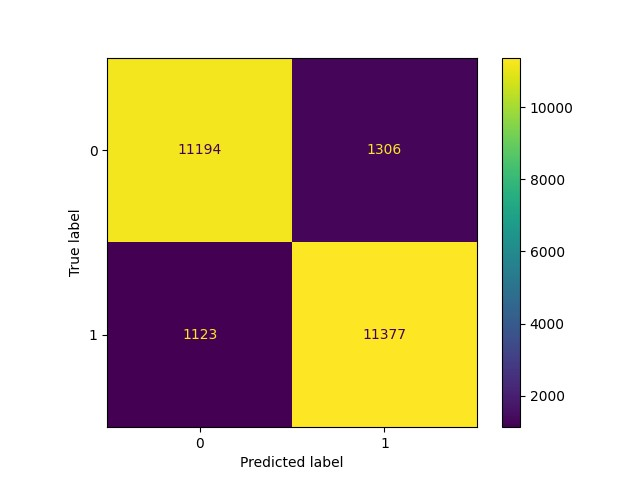

Sentiment Analysis on the IMDB dataset using LLM models. Some points about it:
1. A Large Language Model led to around 90% accuracy for the sentiment analysis on the IMDB dataset available at https://ai.stanford.edu/~amaas/data/sentiment/.
2. The pipeline consists of multiple modules. The pre-processing module process and tokenize the data suitable for a LLM. The training module trains/fine-tunes the LLM with the given data. The inference module makes predictions on the test data. Finally, the evaluation module calculates the accuracy on the given data.
3. Run the code as

python3 -W ignore main.py --max_length 256 --transformer sentence-transformers/all-MiniLM-L6-v2 -lr 0.00001 --n_epochs 10 --batch_size 32

4. Confusion matrix of results 
